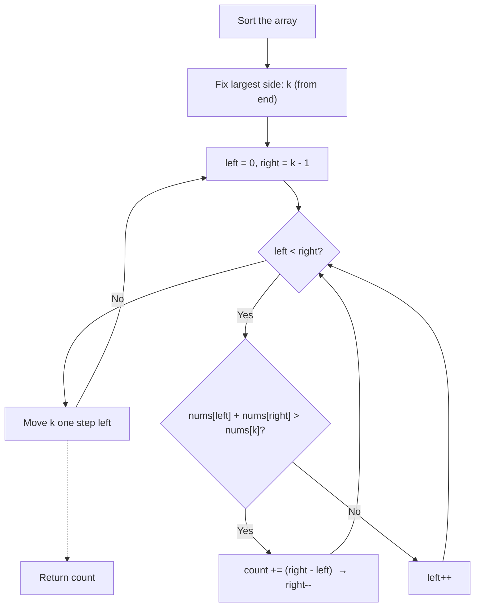

<div align="center">

# 🔺 LeetCode 611 — Valid Triangle Number

### From Brute Force `O(n³)` to Two Pointers `O(n²)`


*"Sort it. Fix the biggest side. Let two pointers do the counting."*

</div>

---

## 📌 The Problem

You're handed an array of non-negative integers — think of them as stick lengths.
Your job: count how many **triplets** of sticks can be arranged into a valid triangle.

```text
Input:  nums = [2, 2, 3, 4]
Output: 3

Valid triplets → (2,2,3), (2,3,4), (2,3,4)
```

Yes, both `(2,3,4)` combos count — they come from different indices.

---

## 🧠 The One Rule That Matters

Three sides form a triangle only if **every** pairwise sum beats the third side:

```
a + b > c
a + c > b
b + c > a
```

That looks like 3 checks... but here's the trick that unlocks the whole problem:

> **Sort the array first.** Once sorted, if `a ≤ b ≤ c`, the only condition left to check is `a + b > c`. The other two are automatically satisfied.

One inequality instead of three. That single observation is the seed for the optimized solution.

---

## 🐢 Attempt #1 — Brute Force

The naive instinct: try every triplet, test the triangle rule, count the wins.

<details>
<summary><strong>Show brute force code</strong></summary>

```javascript
var triangleNumber = function (nums) {
  const n = nums.length;
  nums.sort((a, b) => a - b);
  let count = 0;

  for (let i = 0; i < n - 2; i++) {
    for (let j = i + 1; j < n - 1; j++) {
      for (let k = j + 1; k < n; k++) {
        if (nums[i] + nums[j] > nums[k]) count++;
      }
    }
  }
  return count;
};
```

</details>

| Time | Space |
|:---:|:---:|
| `O(n³)` | `O(1)` |

Correct, but three nested loops scale badly. Time to fix the largest side and think smarter.

---

## 🐇 Attempt #2 — Two Pointers (the good stuff)

**Core idea:** instead of picking three indices independently, sort the array, **fix the largest side (`k`)**, then use two pointers (`left`, `right`) to find pairs that beat it.



### Why does `count += right - left` even work?

Say the sorted window looks like this, with `k` fixed as the largest side:

```
2   3   4     |     5
↑   ↑   ↑           ↑
left    right        k
```

If `nums[left] + nums[right] > nums[k]` holds true, then **every value between `left` and `right`, paired with `right`, will also satisfy it** — because those middle values are ≥ `nums[left]`. So instead of re-checking each one individually, you count them all in one shot: `right - left` pairs, done.

That's the whole trick behind the confusing one-liner.

### Why `right--` after a match?

Every valid pairing that involves `right` has just been fully counted. It has nothing left to offer — shrink the window from the right.

### Why `left++` on a failure?

If the *smallest* value plus the largest available partner still isn't enough, no smaller pairing will work either. The only way to grow the sum is to pick a bigger `left`.

<details>
<summary><strong>Show optimized code</strong></summary>

```javascript
var triangleNumber = function (nums) {
  const n = nums.length;
  nums.sort((a, b) => a - b);
  let count = 0;

  for (let k = n - 1; k >= 2; k--) {
    let left = 0;
    let right = k - 1;

    while (left < right) {
      if (nums[left] + nums[right] > nums[k]) {
        count += right - left;
        right--;
      } else {
        left++;
      }
    }
  }
  return count;
};
```

</details>

| Time | Space |
|:---:|:---:|
| `O(n²)` | `O(1)` |

---

## 🔍 Dry Run — `[2, 2, 3, 4]`

**Sorted:** `2 2 3 4`

**Round 1 — largest side = 4**

```
2   2   3   |   4
↑   ↑           ↑
L   R           k
```
`2 + 3 > 4` → ✅ → `count += (2 - 0) = 2` → shrink `right`

```
2   2       |   4
↑   ↑           ↑
L,R             k
```
`2 + 2 > 4` → ❌ → `left++` → loop ends (`left == right`)

**Running total: 2**

**Round 2 — largest side = 3**

```
2   2   |   3
↑   ↑       ↑
L   R       k
```
`2 + 2 > 3` → ✅ → `count += 1`

**Final answer: 3** ✅

---

## ⚖️ Brute Force vs Two Pointers

| | Brute Force | Two Pointers |
|---|:---:|:---:|
| Time | `O(n³)` | `O(n²)` |
| Space | `O(1)` | `O(1)` |
| Core idea | Check every triplet | Fix largest side, count pair ranges |
| Beginner friendly | ✅ Very | ✅ Once the "why" clicks |

---

## 🎯 Key Takeaways

- Sorting isn't just cleanup — it turns 3 inequality checks into 1.
- Fixing the largest side of a triplet is a recurring pattern in triangle/interval problems.
- `count += right - left` is a **batch-counting trick**: whenever one boundary pair is valid, every pair "inside" it is valid too — so count them all at once instead of looping again.

---

<div align="center">

Built while learning DSA, one two-pointer problem at a time 🚀

</div>
